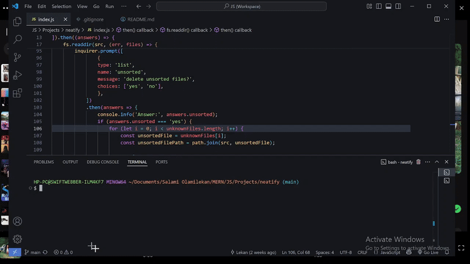

A Node.js script that organizes files into folders by extension. This is my approach to solving the problem, a reverse engineering of the result I saw.    

Here's a video below showing the demo:

> 🔗 [Watch full demo video here](https://drive.google.com/file/d/1zMDJNPYj4WIVJcVHXuD-M6T_iW_xvQty/view?usp=sharing) for a detailed walkthrough.